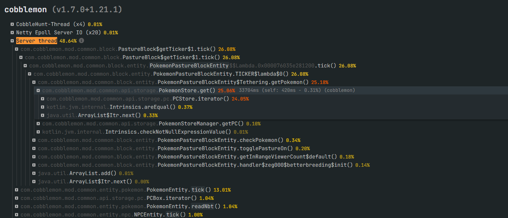
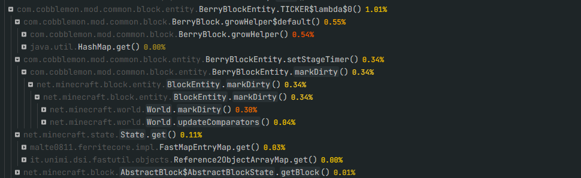

# Cobblemon Performance Mixins

This mod is designed to improve Cobblemon's performance by using optimized **Mixins** that fix, adjust, and refactor
internal behaviors of the base mod. Its goal is to provide a smoother, more stable, and more efficient gameplay
experience without modifying gameplay mechanics or adding new content.

## 📌 Main Features

* 🚀 **Performance optimization** across Cobblemon's internal systems.
* 🛠️ **Fixes for inefficient behaviors** in loops, calculations, or tick events.
* 📉 **Reduced server load** through improvements to frequently executed processes.
* ⚡ **Carefully crafted Mixins** to maintain compatibility without breaking features.
* 🔍 **Focus on stability** and efficient engine behavior.

## 🧩 What does this mod improve?

This mod focuses on optimizing parts of Cobblemon's code that may cause:

* Unnecessary CPU usage.
* Expensive tick operations.
* Excessive load from entities or internal systems.
* Repetitive operations that can be optimized.

Each Mixin is implemented surgically to act only where it is truly necessary.

## 🖼️ Potential Lag Sources Fixed

Below are examples of features or behaviors that, if implemented incorrectly, can cause lag. This mod fixes these
issues:

*This problem can be serious when a mod needs to iterate over a player's PC or party quite frequently.*

*This issue is about optimizing the recalculation of Pokémon showdownId for mods that need to check the showdownId by
internally caching it on the Pokémon when necessary and clearing the cache when the showdownId changes.*

*This issue occurs because Cobblemon does not cache the plant's berry and looks it up in a Map every tick, causing a
noticeable performance loss. Additionally, the use of markDirty is slowed down to happen every 20 ticks per berry
instead of every single tick.*

## 🔧 Installation

1. Make sure you have **Cobblemon** installed.
2. Install a mixin-compatible mod loader (Fabric/Forge, depending on your setup).
3. Place this mod's `.jar` file inside your `mods` folder.
4. Launch your server or client.

## 📄 Compatibility

* Fully compatible with Cobblemon.
* Does not add new items, entities, or mechanics.
* Works with other mods as long as they do not modify the same parts of the code.

## 🤝 Contributing

If you want to suggest an optimization, report an issue, or contribute a new Mixin, feel free to open an issue or pull
request.

## 📜 License

This project is distributed under an open-source license, allowing use and modification as long as original authorship
is respected.

---

✨ *This mod exists solely to deliver a faster, more stable, and overall improved Cobblemon experience for servers and
players, while preserving the essence of the original mod.*
