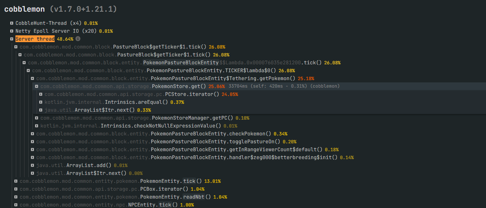
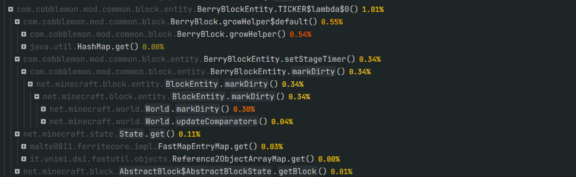

# Cobblemon Performance Mixins

This mod improves **Cobblemon's performance** by using optimized **Mixins** to fix, adjust, and refactor
internal behaviors of the base mod. Its goal is to provide a smoother, more stable, and efficient gameplay
experience **without modifying gameplay mechanics or adding new content**.

---

## 📌 Main Features

* 🚀 **Performance optimizations** across Cobblemon's internal systems
* 🛠️ **Fixes for inefficient behaviors** in loops, calculations, or tick events
* 📉 **Reduced server load** through improvements to frequently executed processes
* ⚡ **Carefully crafted Mixins** to maintain compatibility without breaking features
* 🔍 **Focus on stability** and efficient engine behavior

---

## 🧩 What Does This Mod Improve?

This mod targets code areas in Cobblemon that may cause:

* High CPU usage
* Expensive tick operations
* Excessive entity or system load
* Repetitive operations that can be optimized

> Each Mixin is implemented surgically to act only where necessary.

---

## 🖼️ Example Lag Sources Fixed

Below are some issues this mod addresses:

*Inefficient iteration over a player’s PC or party can cause severe lag.*

*Optimizes recalculation of Pokémon `showdownId` by caching values and clearing them only when necessary.*

*Improves berry handling by caching plants and reducing `markDirty` calls from every tick to once every 20 ticks.*

---

## 🔧 Installation

1. Ensure **Cobblemon** is installed
2. Install a mixin-compatible mod loader (Fabric/Forge)
3. Place this mod's `.jar` file in your `mods` folder
4. Launch your server or client

---

## 📄 Compatibility

* Fully compatible with Cobblemon
* Does **not** add new items, entities, or mechanics
* Compatible with other mods, as long as they don’t modify the same code areas

---

## 🤝 Contributing

We welcome contributions to improve this mod! Please follow our official guidelines:

* Read [`CONTRIBUTING.md`](CONTRIBUTING.md) for instructions on PRs, testing, and coding standards
* Submit a Pull Request (PR) or open an issue for discussion
* By contributing, you agree to the [Contributor License Agreement (CLA)](CLA.md)

> Following these files ensures your contributions are safe, legal, and properly integrated.

---

## 📜 License

This project is distributed under **All Rights Reserved**, but contributions are accepted under the CLA.
For more details, see [`CLA.md`](CLA.md) and [`CONTRIBUTING.md`](CONTRIBUTING.md).

---

✨ *This mod exists solely to deliver a faster, more stable, and improved Cobblemon experience for servers and players,
while preserving the essence of the original mod.*
