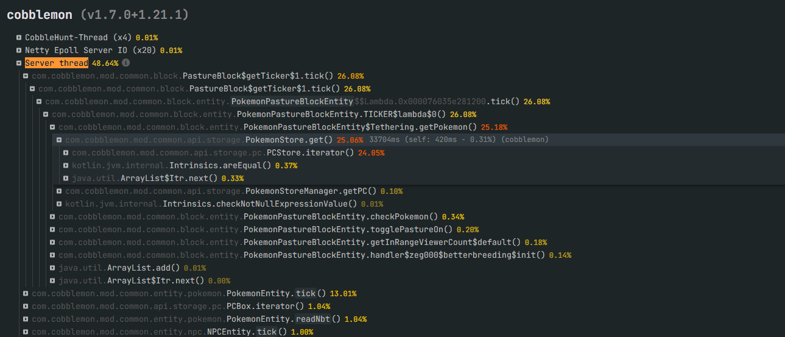
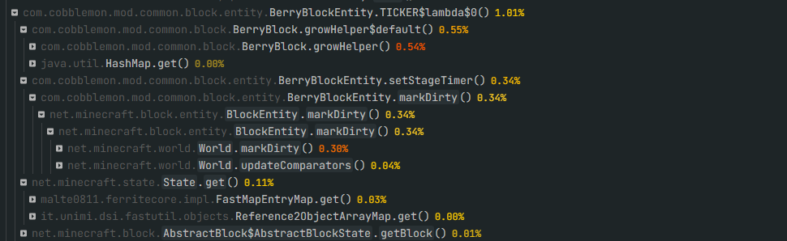

# CobblemonPatches

**CobblemonPatches** is a server and client optimization mod for **Cobblemon (Minecraft 1.21.1)**. It employs surgical **Mixins** to optimize hot paths, resolve memory leaks, fix critical crashes, and eliminate lag machines and duplication exploits—**all without altering core gameplay mechanics or removing features**.

---

## 📌 Key Highlights

- 🚀 **High-Impact Optimizations**: Drastically cuts CPU usage and tick times across Campfire, Berry Blocks, PC storage, Pasture Blocks, Showdown IDs, MoveSet, and EVs serialization.
- 🛡️ **Anti-Lag & Exploit Protection**: Eliminates snowball accumulation exploits (e.g. 100k+ lingering entities) and container duplication exploits.
- 🐛 **Crash Preventions & Thread Safety**: Fixes Fossil Machine crashes, asynchronous entity removal crashes, and NullPointerExceptions on player disconnects.
- ⚡ **Zero Gameplay Compromises**: Preserves 100% vanilla Cobblemon behavior, data structures, and compatibility.
- 🔍 **Spark Profiling Friendly**: Method prefixes (`cobblemonPatches$`) allow easy tracking in Spark/async-profiler samplers.

---

## 🧩 Summary of Features & Patches

For a detailed technical breakdown of every patch, see [`FIXEDS.md`](FIXEDS.md).

### 🚀 Performance & Memory
* **🍳 Campfire Engine**: Caches recipe lookups and item fingerprints to bypass expensive per-tick recipe checks.
* **🫐 Berry Blocks & Trees**: Early-cancels redundant stage timer ticks and caches berry types to eliminate HashMap lookups.
* **🔑 Showdown & Form ID Caching**: Caches `showdownId` and `formOnlyShowdownId` on Pokémon, species, and forms.
* **🧬 Aspect Set Construction**: Direct in-place `LinkedHashSet` generation, eliminating intermediate collection overhead.
* **⚔️ MoveSet Iterator**: Non-allocating move iterator bypassing Kotlin `.filterNotNull()` list allocations.
* **📊 EVs Serialization**: Serializes stats directly from backing maps without cloning to new `HashMap` instances.
* **📦 PC Storage & Box Iterations**: Replaced full `ArrayList` duplication with stream-lined iterator lookups.
* **🏞️ Pasture Blocks**: Caches tethered Pokémon `PCPosition` to avoid scanning entire PC boxes every tick.
* **⚔️ Battle Registry & Queries**: Streamlined battle query checks (`isPvN`, `isPvP`, `isPvW`) and registry lookups.

### 🛡️ Security & Anti-Exploit
* **❄️ Snowball Anti-Lag**: Discards lingering snowballs exceeding 200 ticks (10s) or stagnant stationary projectiles (>40 ticks), preventing 100k+ entity lag attacks.
* **📦 Gilded Chest Anti-Dupe**: Enforces strict distance checks (`canPlayerUse`) to prevent container duplication exploits.
* **🗂️ Modular Exploit Architecture**: Structured modular package system (`lag`, `dupe`, `crash`) for server security.

### 🐛 Stability & Bug Fixes
* **🦕 Fossil Machine**: Fixed server crashes when inserting enchanted items or specific survival inventories.
* **🎟️ ChunkTicketManager**: Fixed `NullPointerException` when players leave unregistered chunks.
* **🔴 Empty Poké Ball**: Fixed `NullPointerException` during capture sequences when players disconnect mid-flight.
* **🌳 Saccharine Tree**: Fixed asynchronous entity removal crashes on hybrid/multi-threaded servers.
* **👥 Concurrency Safety**: Forces party Pokémon removal onto the main thread to prevent race conditions.

---

## 🖼️ Visual Examples of Addressed Issues

*Inefficient iteration over player PC boxes causing major server tick lag.*

*Constant recalculation of Pokémon `showdownId` on hot paths.*

*Berry blocks performing expensive state lookups and map queries on every tick.*

---

## 🔧 Installation & Requirements

1. Ensure **Minecraft 1.21.1** and **Fabric Loader** (>= 0.16.x) are installed.
2. Ensure **Cobblemon** (1.7.3+) is present in your `mods` folder.
3. Place the `CobblemonPatches-x.x.x.jar` file into your `mods/` directory.
4. Start your client or server.

---

## 📄 Documentation & Links

- 📋 [**Detailed Fixes & Improvements**](FIXEDS.md)
- 📝 [**Changelog**](CHANGELOG.md)
- 🤝 [**Contributing Guidelines**](CONTRIBUTING.md)
- 📜 [**Contributor License Agreement (CLA)**](CLA.md)
- ⚖️ [**License**](LICENSE)

---

✨ *Built with care to provide the cleanest, fastest, and most stable Cobblemon experience.*
